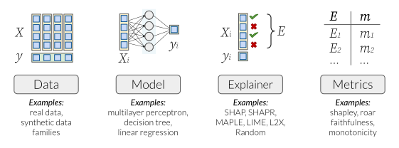

<p align="center"></p>

`XAI-Bench` is a library for benchmarking feature attribution techniques using synthetic data. Unlike real-world datasets, synthetic datasets allow the efficient computation of conditional expected values that are needed to evaluate many explainability metrics such as ground-truth Shapley values, faithfulness, and monotonicity. This repository can be used to benchmark six different feature attribution techniques across five popular evaluation metrics.

See our NeurIPS Datasets Track paper at https://arxiv.org/abs/2106.12543.

<p align="center"></p>


## Installation

To use our package, make sure you install all the dependencies in `requirements.txt` using 
```
pip install -r requirements.txt
```

## Sample Usage

We use an `Experiment` to benchmark various datasets, models, explainers, metrics. This is the recommended way to access our library.

To run a sample benchmarking experiment on our `GaussianPiecewiseConstant` dataset using the sample config `configs/experiment_config.json`, run
```
python main_driver.py --mode regression --seed 7 --experiment --experiment-json configs/experiment_config.jsonc --no-logs
```
For running several experiments across multiple datasets, use a script as shown in,
```
./script.sh
```
Each `Experiment` object is saved after execution for checkpointing. This way, additional experiments can be run without having to rerun previous computation.

---
## More details

The API uses `main_driver.py` which takes in the arguments - 

```
> python main_driver.py -h

usage: Driver for the explainability project [-h] [--mode {classification,regression}] --dataset DATASET --model MODEL --explainer
                                             EXPLAINER [--metric METRIC]
                                             [--data-kwargs DATA_KWARGS | --data-kwargs-json DATA_KWARGS_JSON]
                                             [--model-kwargs MODEL_KWARGS | --model-kwargs-json MODEL_KWARGS_JSON] [--seed SEED]
                                             [--experiment] [--rho RHO] [--rhos RHOS [RHOS ...]] [--experiment-json EXPERIMENT_JSON]
                                             [--no-logs] [--results-dir RESULTS_DIR]

optional arguments:
  -h, --help            show this help message and exit
  --mode {classification,regression}
                        Classification or regression?
  --dataset DATASET     Name of the dataset to train on
  --model MODEL         Algorithm to use for training
  --explainer EXPLAINER
                        Explainer to use
  --metric METRIC       Metric to evaluate the explanation
  --data-kwargs DATA_KWARGS
                        Custom data args needed to generate the dataset.\n Default = '{}'
  --data-kwargs-json DATA_KWARGS_JSON
                        Path to json file containing custom data args.
  --model-kwargs MODEL_KWARGS
                        Custom data args needed to generate the dataset.\n Default = '{}'
  --model-kwargs-json MODEL_KWARGS_JSON
                        Path to json file containing custom data args.
  --seed SEED           Setting a seed to make everything deterministic.
  --experiment          Run multiple experiments using an experiment config file.
  --rho RHO             Control the rho of an experiment.
  --rhos RHOS [RHOS ...]
                        Control the rhos of a mixture experiment.
  --experiment-json EXPERIMENT_JSON
  --no-logs             whether to save results or not. You can use this avoid overriding your result files while testing.
  --results-dir RESULTS_DIR
                        Path to save results in csv files.
```

## Citation 
Please cite our work if you use code from this repo:
```bibtex
@inproceedings{xai-bench-2021,
  title={Synthetic Benchmarks for Scientific Research in Explainable Machine Learning}, 
  author={Liu, Yang and Khandagale, Sujay and White, Colin and Neiswanger, Willie}, 
  booktitle={Advances in Neural Information Processing Systems Datasets Track},
  year={2021}, 
} 
```
